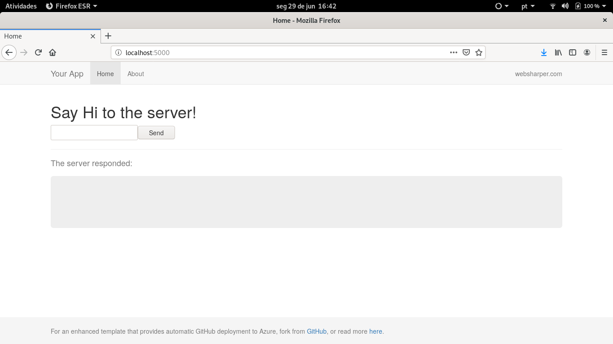
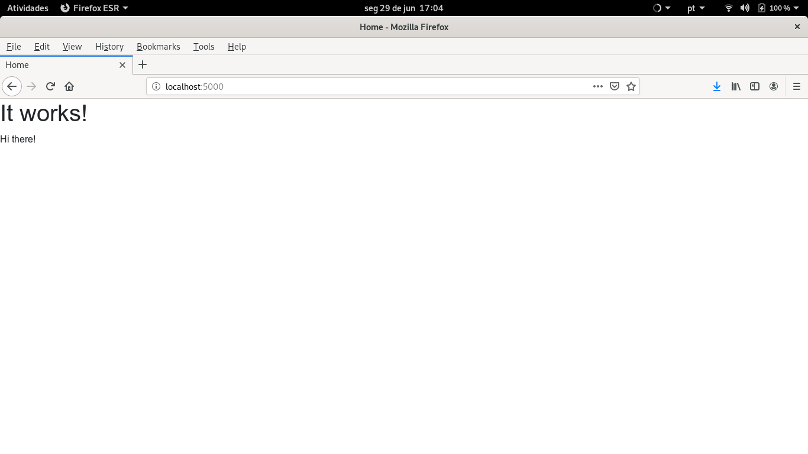

- [Chapter 01 - Foundations](#sec-1)
  - [Creating the WebSharper project](#sec-1-1)
  - [Project requirements](#sec-1-2)
  - [The basic HTML template](#sec-1-3)
    - [Template and special attributes](#sec-1-3-1)
  - [Consuming the basic HTML template](#sec-1-4)

# Chapter 01 - Foundations<a id="sec-1"></a>

## Creating the WebSharper project<a id="sec-1-1"></a>

The final application has only one .NET project, but you probably might want to split it as per your needs.

First, let's install the WebSharper templates:

```bash
$ dotnet new -i WebSharper.Templates
```

After installing the [WebSharper templates](http://www.websharper.com/downloads), open a console (I'm using bash) and create the web client-server project as:

```bash
$ mkdir tutorial
$ cd tutorial
$ dotnet new websharper-web -lang f# -n WebSharperTutorial.FrontEnd
```

The last command creates a folder named WebSharperTutorial.FrontEnd containing a few source code and setup files for the basic project.

Let's create a solution and add the project to it:

```bash
$ dotnet new sln -n WebSharperTutorial
$ dotnet sln WebSharperTutorial.sln add WebSharperTutorial.FrontEnd/WebSharperTutorial.FrontEnd.fsproj
```

Now, let's build and test it:

```bash
$ dotnet build
$ dotnet run --project WebSharperTutorial.FrontEnd/WebSharperTutorial.FrontEnd.fsproj
```

If you load the test page at <http://localhost:5000/>, you might see the following page at your default browser now:



## Project requirements<a id="sec-1-2"></a>

This tutorial contains the following UI structure:

-   home page
-   login page
-   access denied page
-   listing page (access restricted)
-   form page (access restricted)

Both listing and form pages are only available after the user gets logged in.

Below, the list of requirements for each page

-   home page
    -   navbar with:
        -   brand
        -   link to login page
-   login page
    -   navbar: same as home page
    -   form
-   listing page
    -   navbar with:
        -   link to itself
        -   logout
    -   table for listing data
-   form page
    -   navbar: same as listing page
    -   form

Additional requirements:

-   Bootstrap 4
-   each page might have it's own URL
-   long calls to the server might display a animated gif

## The basic HTML template<a id="sec-1-3"></a>

First, let's create the basic HTML frame for the application. For this, we are going the make use of WebSharper's template engine.

Let's create a new folder named "templates" at the WebSharperTutorial.FrontEnd folder:

```bash
$ cd WebSharperTutorial.FrontEnd 
$ mkdir templates
$ mv Main.html templates/
```

Now, open the templates/Main.html file with your chosen editor and delete its content. We are going to create a new one from scratch.

As we are going to use Bootstrap 4, let's copy and paste the recommended template from their website and paste it in templates/Main.html file

```html
<!doctype html>
<html lang="en">
  <head>
    <!-- Required meta tags -->
    <meta charset="utf-8">
    <meta name="viewport" content="width=device-width, initial-scale=1, shrink-to-fit=no">

    <!-- Bootstrap CSS -->
    <link rel="stylesheet" href="https://stackpath.bootstrapcdn.com/bootstrap/4.4.1/css/bootstrap.min.css" integrity="sha384-Vkoo8x4CGsO3+Hhxv8T/Q5PaXtkKtu6ug5TOeNV6gBiFeWPGFN9MuhOf23Q9Ifjh" crossorigin="anonymous">

    <title>Hello, world!</title>
  </head>
  <body>
    <h1>Hello, world!</h1>

    <!-- Optional JavaScript -->
    <!-- jQuery first, then Popper.js, then Bootstrap JS -->
    <script src="https://code.jquery.com/jquery-3.4.1.slim.min.js" integrity="sha384-J6qa4849blE2+poT4WnyKhv5vZF5SrPo0iEjwBvKU7imGFAV0wwj1yYfoRSJoZ+n" crossorigin="anonymous"></script>
    <script src="https://cdn.jsdelivr.net/npm/popper.js@1.16.0/dist/umd/popper.min.js" integrity="sha384-Q6E9RHvbIyZFJoft+2mJbHaEWldlvI9IOYy5n3zV9zzTtmI3UksdQRVvoxMfooAo" crossorigin="anonymous"></script>
    <script src="https://stackpath.bootstrapcdn.com/bootstrap/4.4.1/js/bootstrap.min.js" integrity="sha384-wfSDF2E50Y2D1uUdj0O3uMBJnjuUD4Ih7YwaYd1iqfktj0Uod8GCExl3Og8ifwB6" crossorigin="anonymous"></script>
  </body>
</html>
```

### Template and special attributes<a id="sec-1-3-1"></a>

This is a good time to introduce the WebSharper's template engine.

WebSharper allows us to create a template from a HTML file through the F# Type Provider.

The template, once loaded in your code, allows composition with other elements and also to change its content through the ***ws-holes*** and ***ws-replace*** attributes. The difference between them, is the latter will replace its container element, while the former will insert the new content into the container element.

WebSharper also provides three special attributes: ***scripts***, ***meta*** and ***styles***. These attributes are reserved ones used by the framework to inject embedded resources and the transpiled scripts into the template files.

Let's add them to the ***Main.html*** template, by replacing it by the following:

```html
<!doctype html>
<html lang="en">
  <head>
    <!-- Required meta tags -->
    <meta charset="utf-8">
    <meta name="viewport" content="width=device-width, initial-scale=1, shrink-to-fit=no">

    <!-- Bootstrap CSS -->
    <link rel="stylesheet" href="https://stackpath.bootstrapcdn.com/bootstrap/4.4.1/css/bootstrap.min.css" integrity="sha384-Vkoo8x4CGsO3+Hhxv8T/Q5PaXtkKtu6ug5TOeNV6gBiFeWPGFN9MuhOf23Q9Ifjh" crossorigin="anonymous">

    <title>${Title}</title>

    <meta ws-replace="meta" />
    <meta ws-replace="styles" />
  </head>
  <body>
    <div ws-replace="Body"></div>

    <!-- Optional JavaScript -->
    <!-- jQuery first, then Popper.js, then Bootstrap JS -->
    <script src="https://code.jquery.com/jquery-3.4.1.slim.min.js" integrity="sha384-J6qa4849blE2+poT4WnyKhv5vZF5SrPo0iEjwBvKU7imGFAV0wwj1yYfoRSJoZ+n" crossorigin="anonymous"></script>
    <script src="https://cdn.jsdelivr.net/npm/popper.js@1.16.0/dist/umd/popper.min.js" integrity="sha384-Q6E9RHvbIyZFJoft+2mJbHaEWldlvI9IOYy5n3zV9zzTtmI3UksdQRVvoxMfooAo" crossorigin="anonymous"></script>
    <script src="https://stackpath.bootstrapcdn.com/bootstrap/4.4.1/js/bootstrap.min.js" integrity="sha384-wfSDF2E50Y2D1uUdj0O3uMBJnjuUD4Ih7YwaYd1iqfktj0Uod8GCExl3Og8ifwB6" crossorigin="anonymous"></script>

    <script ws-replace="scripts"></script>
  </body>
</html>
```

Notice the **${Title}** placeholder at the **<title>** HTML tag. This is used for readonly data. WebSharper also provides placeholders for reactive variables, which we are going to rely on, when building the listing and form pages.

Also, there is a ***div*** with the **ws-replace="Body"** attribute. This placeholder will be used by to render the pages' contents.

## Consuming the basic HTML template<a id="sec-1-4"></a>

Now that we have the basic HTML frame create, the next step is to use it from the F# code.

Let's create a new ***Main.fs*** file to load and render this template. Also remove those created by the WebSharper template project.

From the WebSharperTutorial.FrontEnd folder:

```bash
$ rm Remoting.fs
$ rm Client.fs
$ rm Site.fs
$ touch Main.fs
```

> Note: the ***touch*** command just create a new file, on Linux. If you are using Windows, just create a new file using your editor or IDE.

Edit the WebSharperTutorial.FrontEnd.fsproj file, remove the reference for the deleted files and add a reference to the new one. This is how mine looks like after this change:

```xml
<Project Sdk="Microsoft.NET.Sdk.Web">

  <PropertyGroup>
    <TargetFramework>netcoreapp3.1</TargetFramework>
  </PropertyGroup>

  <ItemGroup>
    <Content Include="templates/Main.html" CopyToPublishDirectory="Always" />
    <Compile Include="Main.fs" />
    <Compile Include="Startup.fs" />
    <None Include="wsconfig.json" />
  </ItemGroup>

  <ItemGroup>
    <PackageReference Include="WebSharper" Version="4.6.6.407" />    
    <PackageReference Include="WebSharper.FSharp" Version="4.6.6.407" />
    <PackageReference Include="WebSharper.UI" Version="4.6.3.219" />
    <PackageReference Include="WebSharper.AspNetCore" Version="4.6.2.136" />
  </ItemGroup>

</Project>
```

Edit the ***Main.fs*** file and add the following code:

```fsharp
namespace WebSharperTutorial.FrontEnd

open WebSharper
open WebSharper.Sitelets
open WebSharper.UI
open WebSharper.UI.Server

type EndPoint =
    | [<EndPoint "/">] Home

module Site =
    open WebSharper.UI.Html

    type MainTemplate = Templating.Template<"templates/Main.html">

    let private MainTemplate ctx action (title: string) (body: Doc list) =
        Content.Page(
            MainTemplate()
                .Title(title)
                .Body(body)
                .Doc()
        )

    let HomePage ctx =
        MainTemplate ctx EndPoint.Home "Home" [
            h1 [] [text "It works!"]
            div [] [ text "Hi there!" ]
        ]

    [<Website>]
    let Main =
        Application.MultiPage (fun ctx endpoint ->
            match endpoint with
            | EndPoint.Home -> HomePage ctx
        )

```

Build and run it again:

```bash
$ dotnet build
$ donet run # if you are in the WebSharperTutorial.FrontEnd directory
# if from the solution directory
$ dotnet run --project WebSharperTutorial.FrontEnd/WebSharperTutorial.FrontEnd.fsproj
```

This is what you might see:



| [previous](./cookbook-introduction.md) | [up](../README.md) | [Chapter 02 - Routing and Resources](./cookbook-chapter-02.md) |
