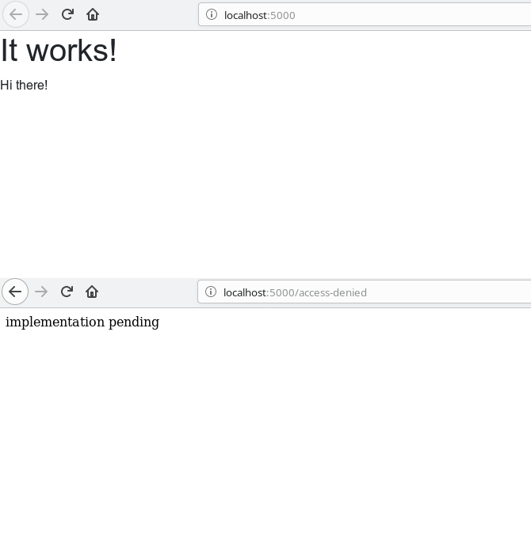
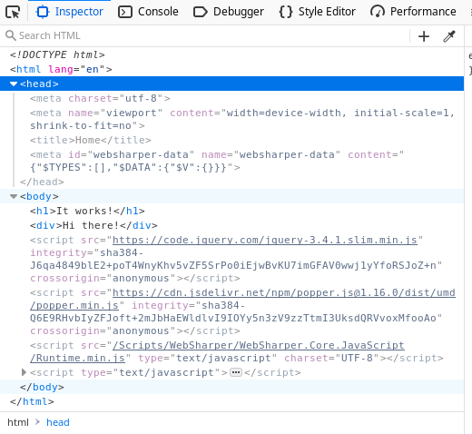
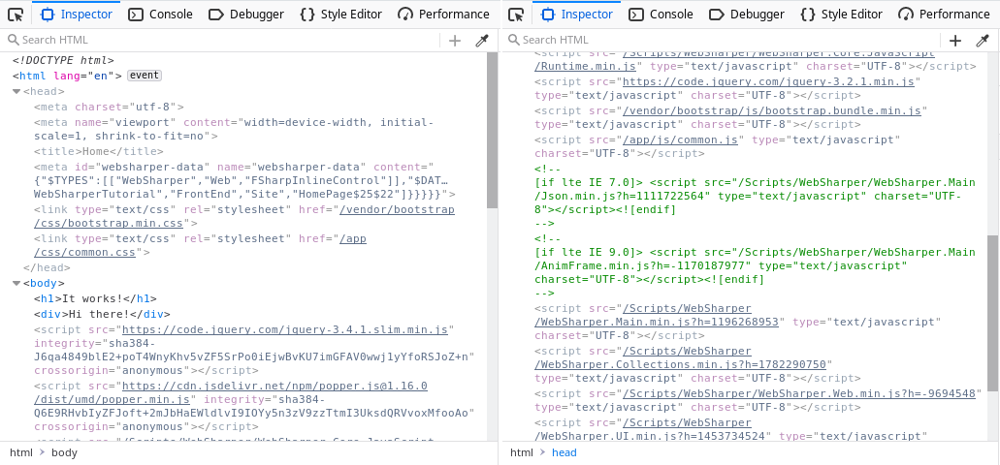

- [Chapter 02 - Routing and Resources](#sec-1)
  - [the routing system](#sec-1-1)
  - [embedding resources](#sec-1-2)

# Chapter 02 - Routing and Resources<a id="sec-1"></a>

## the routing system<a id="sec-1-1"></a>

At this point, we've created the basic structure for the project. In this section, we are going to add support for navigation among web pages and also see how to use embedded resources.

Additionally, we are going to change the ***Main.fs*** file to handle the routes and render the corresponding page.



Let's get started.

Create a new file named ***Routes.fs*** and add it to ***.fsproj*** file. This file must come before the ***Main.fs***.

> Note: from now on, whenever you create a new file, make sure to add it into the ***.fsproj*** file, as I'm not going to mention it anymore.

```xml
<ItemGroup>
  ...
  <Compile Include="Routes.fs" />
  <Compile Include="Main.fs" />
  ...
```

Edit the ***Routes.fs*** file and add to following content to it:

```fsharp
namespace WebSharperTutorial.FrontEnd

open System
open WebSharper
open WebSharper.Sitelets
open WebSharper.UI

module Routes =

    [<JavaScript>]
    type EndPoint =
        | [<EndPoint>] Home
        | [<EndPoint>] Login
        | [<EndPoint>] AccessDenied
        | [<EndPoint>] Listing
        | [<EndPoint>] Form of int64

```

As you can see, we've created 5 endpoints, one for each page in the application.

Notice the ` [<JavaScript>] ` attribute at the **EndPoint** type. This attribute is used by WebSharper compiler to transpile this type onto the JavaScript equivalent one.

The ` [<EndPoint>] ` attribute before each discriminated union option makes them available to WebSharper routing engine.

This attribute provides a few options to setup the route for each endpoint, such as declaring the HTTP method (GET,POST) and the URL path, e.g. ` [<EndPoint "POST /private/form">] `

But for this tutorial, we are going to use a more advantage configuration, by customizing the `Router<'T>` mapping.

The next code lists this customized router. Add it to the end of the ***Routes.fs*** file:

```fsharp
(* Router is used by both client and server side *)
[<JavaScript>]
let SiteRouter : Router<EndPoint> =
    let link endPoint =
        match endPoint with
        | Home -> [ ]
        | Login -> [ "login" ]
        | AccessDenied -> [ "access-denied" ]
        | Listing -> [ "private"; "listing" ]
        | Form code -> [ "private"; "form"; string code ]

    let route (path) =
        match path with
        | [ ] -> Some Home
        | [ "login" ] -> Some Login
        | [ "access-denied" ] -> Some AccessDenied
        | [ "private"; "listing" ] -> Some Listing
        | [ "private"; "form"; code ] -> Some (Form (int64 code))
        | _ -> None

    Router.Create link route

```

The ` SiteRouter ` value has two functions named link and route. The link function is responsible for mapping the **EndPoint** to the URL path, while the route function maps the path back to the **EndPoint**.

The last line, creates a Router using the WebSharper function `Router.Create`, using both functions `link` and `route`. There are several options for build customized routes, including the ` Router.CreateWithQuery ` function, which might be useful when you need to setup dynamic URLs.

This routing model allows full control over the routing options.

Finally, we need to install the router, so WebSharper can use it. Notice that we turn off the `AccessDenied` **EndPoint** by using the `Router.Slice` utility function.

```fsharp
[<JavaScript>]
let InstallRouter () =
    let router =
        SiteRouter
        |> Router.Slice
            (fun endpoint ->
                (* Turn off client side routing for AccessDenied endpoint *)
                match endpoint with
                | AccessDenied -> None
                | _ -> Some endpoint
            )
            id
        |> Router.Install Home
    router

```

This function returns a `Var<EndPoint>` value, which allows us to navigation among the EndPoints. The ` Router.Install ` function is responsible for building such object.

Note: **Var** refers to the Reactive Variable type provided by WebSharper and will be introduced later in this tutorial.

The last step here is to replace the `EndPoint` type in the ***Main.fs*** file by this new one:

```fsharp
// Delete this type
type EndPoint =
    | [<EndPoint "/">] Home

// open the Routes namespace
module Site =
    open WebSharper.UI.Html
    open WebSharperTutorial.FrontEnd.Routes // <-- add this line
    ...

// and replace the Main value by this one
    [<Website>]
    let Main =
        Sitelet.New
            SiteRouter
            (fun ctx endpoint ->
                match endpoint with
                | EndPoint.Home -> HomePage ctx
                | _ ->
                    MainTemplate ctx EndPoint.Home "not implemented"
                        [ div [] [ text "implementation pending" ] ]
            )

```

You might want to build an run the project to test this changes. Try other route to see if it works (e.g. <http://localhost:5000/access-denied>).

## embedding resources<a id="sec-1-2"></a>

The basic template references some external ***.css*** and ***.js*** files. In this section, we are going to replace them by WebSharper's resource system.

Let's create a new file named ***Resources.fs*** and add to the ***.fsproj*** file, as usual.

For now, we are going to embed only the Bootstrap files. Also, we are going to change the default path to JQuery library, each is used by WebSharper framework (pending: add app.config and change JQuery's path).

First, the Bootstrap files.

Download the Bootstrap bundle file from the their website and place the dist content at `<project-path>/wwwroot/vendor/bootstrap/` directory.

Now, add the following code to the ***Resources.fs*** file:

```fsharp
namespace WebSharperTutorial.FrontEnd

open System
open WebSharper
open WebSharper.Resources

module AppResources =

    module Bootstrap =
        [<Require(typeof<JQuery.Resources.JQuery>)>]
        type Js() =
            inherit BaseResource("/vendor/bootstrap/js/bootstrap.bundle.min.js")
        type Css() =
            inherit BaseResource("/vendor/bootstrap/css/bootstrap.min.css")

    module FrontEndApp =
        type Css() =
            inherit BaseResource("/app/css/common.css")

        type Js() =
            inherit BaseResource("/app/js/common.js")

    [<assembly:Require(typeof<Bootstrap.Js>);
      assembly:Require(typeof<Bootstrap.Css>);
      assembly:Require(typeof<FrontEndApp.Css>);
      assembly:Require(typeof<FrontEndApp.Js>);
      >]
    do()

```

Notice that we also created a resource (`FrontEndApp`) for Javascript and stylesheet used by our application. This files must be created at `<project-path>/wwwroot/app/`.

The last step is to remove the reference from the ***template/Main.html*** file

```html
<!-- remove the lines below -->

<!-- Bootstrap CSS -->
<link rel="stylesheet" href="https://stackpath.bootstrapcdn.com/bootstrap/4.4.1/css/bootstrap.min.css" integrity="sha384-Vkoo8x4CGsO3+Hhxv8T/Q5PaXtkKtu6ug5TOeNV6gBiFeWPGFN9MuhOf23Q9Ifjh" crossorigin="anonymous">

...
<script src="https://stackpath.bootstrapcdn.com/bootstrap/4.4.1/js/bootstrap.min.js" integrity="sha384-wfSDF2E50Y2D1uUdj0O3uMBJnjuUD4Ih7YwaYd1iqfktj0Uod8GCExl3Og8ifwB6" crossorigin="anonymous"></script>

```

Let's test it. Build and run the application again and check the source code with the browser Inspector.

> Note: you might need to run "dotnet clean" before build it, to get the template page updated.

If you check the browser inspector, you will notice both Bootstrap and application ***.css*.fs/** files wheren't loaded.



**This is a very important point about how WebSharper client code works**: these resources won't be loaded until any WebSharper's client code is invoked. And you as might recall, we only render a static page built on the server, until now.

To make it work, change the following line in the ***Main.fs*** file and rebuild the solution again.

```fsharp
...
let HomePage ctx =
    MainTemplate ctx EndPoint.Home "Home" [
        h1 [] [text "It works!"]
        client <@ div [] [ text "Hi there!" ] @>
    ]
...
```

Rebuild the project and open it on the browser again. Now you might see the ***.css*.fs/** resources with the browser Inspector.



| [previous](./cookbook-chapter-01.md) | [up](../README.md) | [next](./cookbook-chapter-03.md) |
